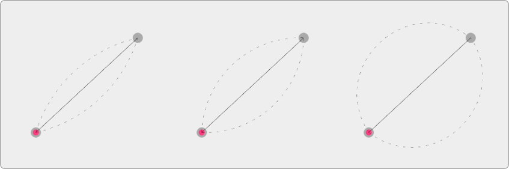
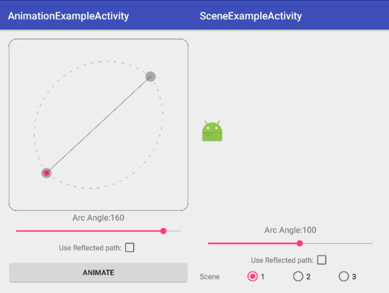

ArcMotionPlus
=======

# What is ArcMotionPlus?

The ArcMotionPlus describes a curve that is a section of a circle between two points. The aim of the ArcMotionPlus lib is to provide an easy to use, robust and more configurable version of the Android ArcMotion class. The ArcMotionPlus class takes one parameter to describe the angle of the arc between a start and end point, and it also has a parameter that allows this arc to be reflected through the line that joins the start and end points. For example if we have two points on a horizontal line, by reflecting the arc we can determine if it goes above or below the line. The ArcMotionPlus class makes use of the CubicBezierArc class to calculate controls points for a cubic bezier. The CubicBezierArc class can also be used to generate paths for use in an Android Canvas or ObjectAnimators.





# Using the ArcMotionPlus

Using the ArcMotionPlus is straightforward. There are a just two settings 

* Arc Angle
* Reflect

The Arc-angle defines how curved the arc is between the start and end points. The greater the arc-angle the greater the curve. Valid values for the arc-angle are 1 - 179. A value of 179 approximates to a semicircle between the two lines. The reflect setting defines if we should reflect the arc through the line joining the start and end points.  

## To use it in your code

Simply add the ArcMotionPlus to your transition XML.

    <transitionSet
        xmlns:android="http://schemas.android.com/apk/res/android"
        xmlns:app="http://schemas.android.com/apk/res-auto">
        <changeBounds>
            <pathMotion class="com.oeri.arcmotionplus.ArcMotionPlus"
                app:arcAngle="100"
                app:reflect="false"/>
        </changeBounds>
    </transitionSet>
            

Or use it directly in your java code:

    ArcMotionPlus arcMotion = new ArcMotionPlus();
    arcMotion.setReflectedArc(true);
    arcMotion.setArcAngle(100);
    
To use the CubicBezierArc it can be instantiated like so:

    CubicBezierArc cubicBezierArc = new CubicBezierArc(arcAngle, startX, startY, endX, endy);

We can then access the generated control points and reflected controls point like this:
    
    cubicBezierArc.getControlPoint1().x
    cubicBezierArc.getControlPoint1().y
    cubicBezierArc.getControlPoint2().x
    cubicBezierArc.getControlPoint2().y
    cubicBezierArc.getReflectedControlPoint1().x
    cubicBezierArc.getReflectedControlPoint1().y
    cubicBezierArc.getReflectedControlPoint2().x
    cubicBezierArc.getReflectedControlPoint2().y
These values can then be used to generate Path objects that can be used in the Android canvas or with ObjectAnimators.  
## Adding to your project

I've linked this library to jcenter, so if you have jcenter declared as a repository in you project build.gradle (which will be the case for most android projects) you can just add the library dependancy in you app build file like this:

```groovy
    dependencies {
        compile 'com.oeri.arcmotionplus:arcmotionplus:1.0.2'
    }
```

## Version 1.0.0

* init release

## Version 1.0.1

* Update min sdk to 14 so ArcMotionPlus can be used with support lib version of Transition framework.

## Version 1.0.2

* Remove uneeded application element from lib Manifest


# Sample Project

You can see the ArcMotionPlus and CubicBezierArc classes working in the sample application. Just check out the Android studio sample project. The sample app will let you explore what can be done with these classes. 





# License

```
  Copyright (C) 2016 Neil Davies
 
  Licensed under the Apache License, Version 2.0 (the "License");
  you may not use this file except in compliance with the License.
  You may obtain a copy of the License at
 
      http://www.apache.org/licenses/LICENSE-2.0
 
  Unless required by applicable law or agreed to in writing, software
  distributed under the License is distributed on an "AS IS" BASIS,
  WITHOUT WARRANTIES OR CONDITIONS OF ANY KIND, either express or implied.
  See the License for the specific language governing permissions and
  limitations under the License.
```
